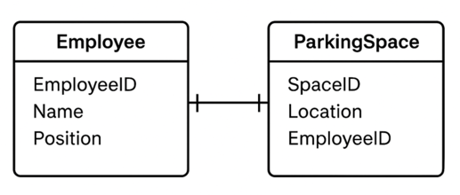
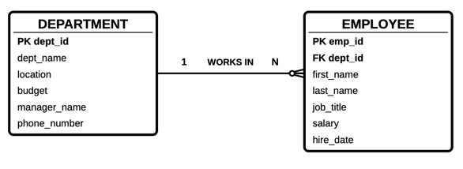
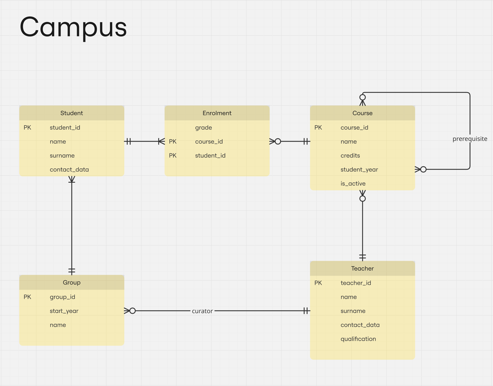

# Конспект лекції - ER-діаграми та налаштування локального середовища розробки

## Тематика лекції

1. Діаграми "сутність-зв'язок" (ER-діаграми) - ваші креслення для проєктування баз даних
2. Локальне середовище розробки - ваш інструментарій для практичної роботи з базами даних

### Чому ці теми важливі
- ER-діаграми: Кожен професійний проєкт бази даних починається з правильного проєктування
- Середовище розробки: Потрібен надійний, послідовний робочий простір для навчання та експериментів

---

# ЧАСТИНА 1: ДІАГРАМИ "СУТНІСТЬ-ЗВ'ЯЗОК" (ER-ДІАГРАМИ)

---

## 1.1. Вступ

ER-діаграми (діаграми "сутність-зв'язок") - це інструмент для візуалізації структури бази даних, що показує:
- які дані зберігаються у системі
- як ці дані пов'язані між собою

Вони потрібні для:
- документації системи
- планування побудови та розвитку функціоналу
- спрощення комунікації між розробниками, аналітиками та менеджментом

---

## 1.2. Значення ER-діаграм

- Дає візуальне представлення внутрішнього дизайну бази даних.
- Полегшує розуміння структури при великій кількості таблиць.
- Допомагає уникнути читання SQL-скриптів створення таблиць для розуміння структури бази даних.
- Використовується для обговорення проєктних рішень із менш технічними учасниками (наприклад, менеджерами).

---

## 1.3. Процес проєктування бази даних

1.  **Збір бізнес-вимог** - що зберігати і як це пов'язано.
2.  **Побудова ER-діаграми** на основі вимог.
3.  **Обговорення дизайну** (структури, атрибутів, зв'язків).
4.  **Внесення правок** (цикл уточнень може бути довгим).
5.  **Фіналізація дизайну** і створення таблиць у БД.
6.  **Розвиток системи** з урахуванням діаграми.

---

## 1.4. Основні елементи ER-діаграми

- **Сутність (Entity)** - об'єкт, який зберігається в базі даних (наприклад, Студент, Курс, Викладач).
- **Атрибути (Attributes)** - властивості сутності (наприклад, ім'я, прізвище, ідентифікатор).
- **Зв'язки (Relationships)** - відображають, як сутності пов'язані між собою.


### Компонент 1: Сутності

Сутність - це будь-що, про що ми хочемо зберігати інформацію.

Приклади:
- Студент: Ми хочемо зберігати інформацію про студентів
- Курс: Ми хочемо зберігати інформацію про курси
- Викладач: Ми хочемо зберігати інформацію про викладачів

### Компонент 2: Атрибути

Атрибути - це властивості або характеристики сутностей.

Приклади для сутності Студент:
- ID студента
- Ім'я
- Електронна пошта
- Дата народження
- Спеціальність

Типи атрибутів:

- Прості: Не можуть бути поділені далі - наприклад ID студента або його пошта
- Складні: Можуть бути розбиті на менші частини - наприклад: Ім'я -> Ім'я + Прізвище, Адреса → Вулиця + Місто + Область + Поштовий індекс
- Однозначні: Одне значення на сутність
- Багатозначні: Можливі кілька значень - наприклад Номери телефонів (мобільний, робочий), Адреси електронної пошти (особиста, університетська)
- Збережені: Фактично зберігаються в базі даних
- Похідні: Обчислюються з інших атрибутів - наприклад Розмір групи (обчислюється за кардинальність зв'язку Студент <-> Група)

Ключові атрибути (первинні ключі):
- Унікально ідентифікують кожний екземпляр сутності
- Приклад: ID студента для сутності Студент

### Компонент 3: Зв'язки

Зв'язки представляють асоціації між сутностями.

Приклади:
- Студент **записується на** Курс
- Викладач **викладає** Курс
- Автор **пише** Книгу

## 1.5. Кардинальність зв'язків

Кардинальність визначає, скільки екземплярів однієї сутності може бути асоційовано з екземплярами іншої сутності.

### Зв'язки "один до одного" (1:1)

Кожен екземпляр сутності A асоційований рівно з одним екземпляром сутності B, і навпаки.

Приклад: Співробітник <-> Паркомісце
- Кожен співробітник має рівно одне паркомісце
- Кожне паркомісце закріплено рівно за одним співробітником



### Зв'язки "один до багатьох" (1:N)

Кожен екземпляр сутності A може бути асоційований з кількома екземплярами сутності B, але кожен екземпляр сутності B асоційований лише з одним екземпляром сутності A.

Приклад: Кафедра -> Співробітники
- Одна кафедра може мати багато співробітників
- Кожен співробітник працює на рівно одній кафедрі



### Зв'язки "багато до багатьох" (N:N або M:M або M:N)

Кожен екземпляр сутності A може бути асоційований з кількома екземплярами сутності B, і кожен екземпляр сутності B може бути асоційований з кількома екземплярами сутності A.

Приклад: Співробітник <-> Проект
- Один співробітник може працювати над багатьма проектами
- Над одним проектом може працювати багато співробітників


## 1.6. Кардинальність і обов'язковість зв'язків

- 0 або 1 - зв'язок може бути відсутнім або лише один (наприклад, у викладача може не бути курсів у конкретному семестрі).
- 1 і тільки 1 - обов'язково існує рівно один зв'язок.
- 0 або багато - може бути відсутнім або багато екземплярів.
- 1 або багато - мінімум один екземпляр, може бути більше.

---

## 1.7. Практичний приклад: побудова дизайну бази даних кампусу

### Бізнес-вимоги:
- Є студенти, які можуть відвідувати курси.
- Є викладачі, які читають курси.
- У курсів є передумови (іншими курсами).

### Побудована ER діаграма кампусу



---

## 1.8. Висновки

- ER-діаграми - ключовий інструмент у проєктуванні та документуванні баз даних.
- Вони допомагають ефективно комунікувати дизайн як серед розробників, так і з бізнес-сторонами.
- Грамотне використання зв'язків і кардинальності дозволяє створити гнучку та масштабовану структуру БД.

---

# ЧАСТИНА 2: НАЛАШТУВАННЯ ЛОКАЛЬНОГО СЕРЕДОВИЩА РОЗРОБКИ

---

## 2.1. Вступ

Після розгляду ER-діаграм і логічного проєктування баз даних, наступним кроком є підготовка робочого середовища.  
Мета локального оточення - забезпечити можливість розробникам швидко запускати базу даних і супутні сервіси для тестування та розробки.

---

## 2.2. Чому важливе локальне оточення

- У продакшн-середовищі бази даних зазвичай не запускають у контейнерах, щоб гарантувати максимальну продуктивність та стабільність роботи СУБД.
- У локального середовища розробки пріоритети інші:
    - зручність запуску та зупинки,
    - ізоляція від системи розробника,
    - повторюваність і сумісність між усіма учасниками команди.

---

## 2.3. Використання Docker для локального оточення

Docker дозволяє швидко розгортати бази даних у вигляді контейнерів.
Переваги: 
- простота запуску та видалення,
- можливість мати кілька різних середовищ на одній машині,
- спрощення інсталяції (не потрібно вручну ставити PostgreSQL, MySQL тощо).

### Docker Compose

Використовується для опису всього середовища (наприклад: база даних, pgAdmin, додаткові сервіси).
- Інструмент для визначення багатоконтейнерних додатків
- Використовує YAML-файл для конфігурації сервісів
- Дає змогу підняти цілий стек командою:
    ``` bash
    docker-compose up
    ```
- Ідеально підходить для комбінацій база даних + інструмент адміністрування

---

## 2.4. Основні поняття Docker

- Image (образ) - шаблон лише для читання для створення контейнерів
  - Містить код додатка, середовище виконання, бібліотеки, змінні середовища
  - Як "клас" у об'єктно-орієнтованому програмуванні
  - Можна ділитися та повторно використовувати
- Container (контейнер) - запущений екземпляр образу, з яким можна працювати.
  - Як "об'єкт", створений з класу
  - Можна запускати, зупиняти, видаляти
  - Кілька контейнерів можуть бути створеними з того самого образу
- Volume (том) - спільна файлова система між хостом і контейнером, потрібна для збереження даних між перезапусками. Наприклад, для збереження налаштувань pgAdmin або даних PostgreSQL.

---

## 2.5. Корисні команди Docker

```bash

# Запустити контейнер 
docker run <image> -p <port>:<port>

# Переглянути список створених контейнерів
docker ps -a

# Переглянути логи контейнера
docker logs <container>

# Зупинити контейнер
docker stop <container>

# Видалити контейнер
docker rm <container>
```

```bash

# Запустити набір контейнерів 
docker-compose up -d

# Переглянути статус контейнерів
docker-compose ps

# Переглянути логи контейнера
docker-compose logs <container>

# Зупинити та видалити набір контейнерів
docker-compose down
```

---

## 2.5. Запуск середовища

[Встановлення Docker](https://www.docker.com/get-started)
[Встановлення Docker Compose](https://docs.docker.com/compose/install/)

### Налаштування середовища

1. Клонуйте цей репозиторій:
   ```bash
   git clone https://github.com/ZheniaTrochun/db-intro-course.git
   cd db-intro-course
   ```

2. Запустіть контейнери:
   ```bash
   docker-compose up -d
   ```

3. Щоб зупинити контейнери виконайте:
   ```bash
   docker-compose down
   ```

### Сервіси

#### PostgreSQL

- Порт: 5432
- Ім'я користувача: postgres
- Пароль: password123
- Скрипти ініціалізації: Розмістіть ваші SQL-скрипти в директорії `init-scripts`, щоб вони виконувалися при запуску контейнера

#### pgAdmin

- URL: http://localhost:8080
- Електронна пошта: root@kpi.edu
- Пароль: password123

### Підключення до бази даних

#### Використання pgAdmin

1. Відкрийте http://localhost:8080 у вашому браузері
2. Увійдіть, використовуючи вказані вище облікові дані
3. Додайте новий сервер з наступними налаштуваннями:
    - Назва: Будь-яка назва на ваш вибір
    - Хост: postgres
    - Порт: 5432
    - Ім'я користувача: postgres
    - Пароль: password123

---

## 2.6. Огляд pgAdmin

### Що таке pgAdmin?

pgAdmin - це комплексна веб-платформа адміністрування та розробки для PostgreSQL.

Думайте про це як про:
- Графічний інтерфейс для вашої бази даних
- Як провідник файлів, але для об'єктів бази даних
- Потужний редактор SQL з корисними функціями
- Набір інструментів для адміністрування бази даних

### Ключові функції

1. Браузер об'єктів бази даних
- Деревоподібне представлення всіх об'єктів бази даних
- Таблиці, представлення, функції, індекси

2. Редактор запитів
- Підсвічування синтаксису для SQL
- Автодоповнення
- Історія запитів

3. Візуальні плани виконання
- Графічне представлення виконання запитів
- Аналіз продуктивності

4. Керування даними
- Перегляд даних таблиць
- Редагування даних безпосередньо у сітці
- Імпорт/експорт даних

---

## 2.7. Висновки

- Продакшн - бази даних запускаються безпосередньо на серверах для максимальної продуктивності, стабільності роботи та надійності.
- Розробка - використовуємо Docker та Docker Compose, бо це зручно, швидко і відтворювано.
- Локальне оточення - ключ до стандартизації роботи команди та мінімізації проблем "у мене працює, у тебе - ні".
