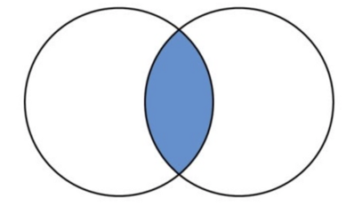

# Конспект лекції - SQL частина 2 - JOIN та операції над множинами у SQL

## 1. Вступ
На лекції розглядаються наступні SQL операції:
- Операції JOIN між таблицями
- Операції над множинами (SET operations): `UNION`, `INTERSECT`, `EXCEPT`

---

## 2. Що таке JOIN та навіщо це

JOIN — це інструмент для поєднання рядків із двох або більше таблиць на основі логічного зв'язку між ними (зазвичай на основі foreign keys).

У нормалізованих базах даних інформація розподілена по різних таблицях.  
Наприклад:
- Таблиця `student`: `id`, `name`, `surname`, `group_id`
- Таблиця `contact_data`: контактні дані студентів
- Таблиця `student_group`: інформація про академічні групи

Іноді потрібно отримати дані одразу з кількох таблиць — саме тоді застосовують JOIN.

---

## 3. Види JOIN

| Вид JOIN | Опис | Приклад використання                          |
|-----------|-------|-----------------------------------------------|
| INNER JOIN | Повертає тільки ті рядки, які мають збіги в обох таблицях | Студенти, які мають контактну інформацію      |
| LEFT JOIN (LEFT OUTER JOIN) | Повертає всі рядки з першої таблиці та відповідні з другої; якщо збігів немає — ставить `NULL` | Всі викладачі, навіть ті, що не курують групи |
| RIGHT JOIN (RIGHT OUTER JOIN) | Дзеркальна версія LEFT JOIN — всі рядки з другої таблиці | Рідко використовується                      |
| FULL OUTER JOIN | Поєднання LEFT і RIGHT JOIN — усі рядки з обох таблиць | Всі студенти та всі групи                     |
| CROSS JOIN | Декартовий добуток двох таблиць (усі комбінації рядків) | Специфічні задачі                             |

---

## 4. INNER JOIN

```sql
SELECT *
FROM student s
INNER JOIN student_group g
ON s.group_id = g.group_id;
```

- `ON` визначає умову поєднання.  
- Результат містить усі колонки обох таблиць, для яких знайдено відповідність.



### Альтернатива з `USING`

Якщо колонки мають однакові назви:
```sql
SELECT *
FROM student
INNER JOIN student_group
USING (group_id);
```

---

## 5. LEFT JOIN

```sql
SELECT *
FROM teacher t
LEFT JOIN student_group g
ON t.teacher_id = g.curator_id;
```

- Всі викладачі з'являться у результаті, навіть ті, що не курують групи.  
- Для викладачів без груп — у колонках груп буде `NULL`.


---

## 6. RIGHT JOIN

- Повністю аналогічний до LEFT JOIN, але виводить усі рядки з другої таблиці.
- Зустрічається рідко, оскільки той самий результат можна отримати, просто помінявши таблиці місцями у LEFT JOIN.
- У переважній більшості випадків потрібно надавати перевагу LEFT JOIN.


---

## 7. FULL OUTER JOIN

```sql
SELECT *
FROM student s
FULL OUTER JOIN student_group g
ON s.group_id = g.group_id;
```

- Повертає всі рядки з обох таблиць.
- Якщо відповідності немає — заповнює поля `NULL`.


---

## 8. CROSS JOIN

```sql
SELECT *
FROM table1 t1, table2 t2;
```

- Не має предиката `ON`.
- Кожен рядок з першої таблиці поєднується з усіма рядками другої таблиці.
- Використовується рідко та у специфічних задачах.


---

## 9. Антиджойни (ANTI-JOIN)

- Використовуються для вибірки рядків з першої таблиці, які не мають відповідників у другій.
- Реалізуються через `LEFT JOIN` із додатковою умовою `WHERE second_table.id IS NULL`.


---

## 10. Підтримка JOIN у різних СУБД

- Не всі системи керування базами даних (СУБД) підтримують усі типи JOIN однаково.
- Деякі можуть не мати `FULL OUTER JOIN` або мати свій синтаксис.
- У курсі розглядається PostgreSQL та його синтаксис.

---

## 11. Операції над множинами (SET OPERATIONS)

Операції над множинами — це операції над наборами рядків, а не над атрибутами.

| Операція | Опис |
|-----------|-------|
| UNION | Об'єднання результатів двох запитів |
| INTERSECT | Перетин результатів |
| EXCEPT | Різниця між результатами |

> ⚠️ Всі операції над множинами вимагають, щоб кількість і типи колонок у запитах збігалися.

---

### 11.1. UNION

```sql
SELECT name FROM student
UNION
SELECT name FROM teacher;
```

- Об'єднує результати обох запитів.
- Дублікатні рядки автоматично видаляються.
- Для збереження дублікатів — `UNION ALL`.


---

### 11.2. INTERSECT

```sql
SELECT name FROM student
INTERSECT
SELECT name FROM teacher;
```

- Повертає лише ті рядки, які є в обох множинах.
- Для включення дублікатів — `INTERSECT ALL`.


---

### 11.3. EXCEPT

```sql
SELECT name FROM student
EXCEPT
SELECT name FROM teacher;
```

- Повертає рядки, які є у першому наборі, але відсутні у другому.


---

## 12. Порівняння JOIN та SET-операцій

| Критерій | JOIN                                                   | Операції над множинами                 |
|-----------|--------------------------------------------------------|----------------------------------------|
| Працює над | Колонками                                              | Рядками                                |
| Результат | Об'єднання атрибутів                                   | Додавання рядків                       |
| Основна ідея | Поєднання пов'язаних даних                             | Комбінація наборів результатів         |
| Взаємозамінність | SET операції можна виразити через JOIN, але не навпаки | JOIN не виражається через SET операції |

---

## 13. Практичне застосування
- Можна комбінувати багато JOIN в одному запиті (20+ — не проблема).
- JOIN та SET-операції часто застосовуються у звітах, аналітичних вибірках, побудові складних представлень.
- У продакшн-системах найчастіше використовуються INNER JOIN, LEFT JOIN, та UNION.

---

## 14. Висновки
- JOIN — основний інструмент для об'єднання таблиць.
- INNER JOIN - найпоширеніший тип JOIN-ів, LEFT JOIN - на другому міці, RIGHT JOIN рідкісний та його слід уникати.
- FULL OUTER JOIN — комбінує LEFT JOIN + RIGHT JOIN.
- Операції над множинами дозволяють поєднувати результати запитів як набори рядків.
- Розуміння JOIN є критичним для написання складних практичних SQL-запитів.

## Додаткові матеріали


1. [Хороша візуалізація JOIN-ів та операцій над множинами](https://imgur.com/sql-joins-set-operators-xLTcOGi)
2. [Що таке ORM](https://www.freecodecamp.org/news/what-is-an-orm-the-meaning-of-object-relational-mapping-database-tools/)
3. [SQL builder libs vs ORMs](https://www.prisma.io/dataguide/types/relational/comparing-sql-query-builders-and-orms)
